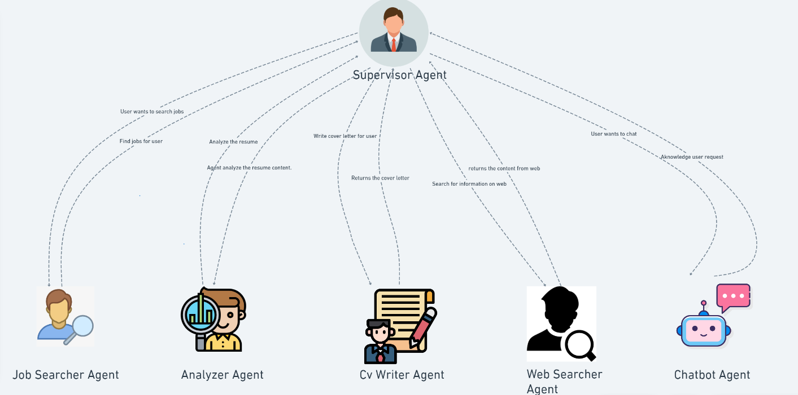
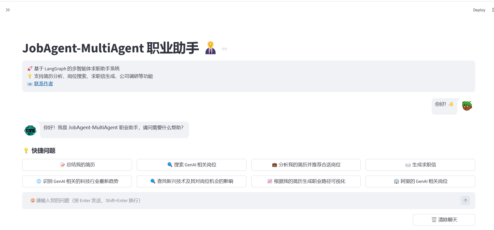

# JobAgent-MultiAgent

<div align="left">



<h1 align="center">基于 LangGraph 的多智能体求职助手系统</h1>

[](https://www.python.org/downloads/)
[](https://github.com/langchain-ai/langchain)
[](https://streamlit.io/)

[功能特性](#-功能特性) • [快速开始](#-快速开始) • [系统架构](#-系统架构) • [使用指南](#-使用指南) • [技术栈](#-技术栈)

---

## 📖 项目简介

JobAgent-MultiAgent 是一个基于 LangGraph 和多智能体协同架构的智能求职助手系统。通过 Supervisor 模式协调多个专业 Agent，为求职者提供从简历分析、岗位搜索、求职信生成到公司调研的一站式求职辅助服务。

> 📚 本项目参考自 [JobPilot-Multi-agent](https://github.com/chenchong911/JobPilot-Multi-agent) 项目

### 🎯 解决的痛点

- **招聘平台碎片化**：信息分散在多个平台，检索效率低
- **岗位文本非结构化**：JD 描述不统一，难以快速匹配
- **求职材料同质化**：简历和求职信缺乏针对性，竞争力不足
- **决策成本高**：需要大量时间进行岗位筛选、公司调研和材料准备

### ✨ 核心价值

- 🔍 **智能职位搜索**：多维度过滤，快速匹配合适岗位
- 📄 **简历智能解析**：自动提取技能、经历、成就要点
- ✉️ **求职信生成**：基于岗位 JD 和简历内容，生成定制化求职信
- 🌐 **公司/行业调研**：快速聚合企业背景信息，辅助决策
- 💬 **多轮对话策略**：支持上下文理解，提供个性化求职建议

---

## 🚀 功能特性

| 功能模块 | 说明 | 核心价值 |
|---------|------|---------|
| **智能职位搜索** | 支持行业、技能、地域、工作类型等多维度过滤 | 降低初筛时间，提高匹配精度 |
| **简历智能解析** | 自动提取技能、经历、成就要点，结构化展示 | 为后续功能提供结构化数据支持 |
| **求职信生成** | 基于岗位 JD 和简历内容，生成定制化求职信 | 提升求职材料的针对性和专业度 |
| **公司/行业调研** | 网页搜索+内容抓取，快速聚合企业背景信息 | 节省调研时间，辅助决策 |
| **多轮对话策略** | 支持追问和上下文理解，提供求职策略建议 | 减少重复输入，提供个性化指导 |
| **可扩展工具层** | 模块化设计，支持自定义工具和数据源接入 | 灵活扩展，适应不同场景需求 |

---

## 🏗️ 系统架构

### 架构设计

采用 **Supervisor + Multi-Agent** 模式，通过中央调度器协调多个专业智能体协同工作。

```
┌─────────────────────────────────────────────────────────┐
│                    Streamlit UI 前端                     │
│          (文件上传 + 对话界面 + 结果展示/下载)            │
└────────────────────┬────────────────────────────────────┘
                     │
                     ▼
┌─────────────────────────────────────────────────────────┐
│                  Supervisor 调度器                       │
│         (意图识别 + 任务分配 + 流程编排)                  │
└─────┬───────┬───────┬───────┬───────┬──────────────────┘
      │       │       │       │       │
      ▼       ▼       ▼       ▼       ▼
┌──────┐ ┌──────┐ ┌──────┐ ┌──────┐ ┌──────┐
│Resume│ │ Job  │ │Cover │ │ Web  │ │Chat  │
│Analyz│ │Search│ │Letter│ │Resear│ │ Bot  │
│  er  │ │  er  │ │Gener │ │ cher │ │      │
└──┬───┘ └──┬───┘ └──┬───┘ └──┬───┘ └──┬───┘
   │        │        │        │        │
   └────────┴────────┴────────┴────────┘
                     │
                     ▼
┌─────────────────────────────────────────────────────────┐
│                    工具层 (Tools)                        │
│  • 简历解析 (PyPDF/PyMuPDF)                              │
│  • 职位搜索 (Serper API)                                 │
│  • 网页抓取 (FireCrawl API)                              │
│  • 文档生成 (python-docx)                                │
└─────────────────────────────────────────────────────────┘
                     │
                     ▼
┌─────────────────────────────────────────────────────────┐
│                  大模型层 (LLMs)                         │
│  • 通义千问 (Qwen)                                       │
│  • OpenAI 兼容接口 (DeepSeek/GPT等)                      │
└─────────────────────────────────────────────────────────┘
```

### 智能体说明

| Agent | 职责 | 工具 |
|-------|------|------|
| **Supervisor** | 意图识别、任务分配、流程编排 | - |
| **ResumeAnalyzer** | 解析和分析简历内容 | resume_extractor, google_search |
| **JobSearcher** | 根据条件搜索匹配岗位 | job_search, google_search |
| **CoverLetterGenerator** | 生成个性化求职信 | generate_letter, save_cover_letter |
| **WebResearcher** | 在线信息搜集和整理 | google_search, scrape_website |
| **ChatBot** | 处理一般性对话和咨询 | - |

---

## 💻 技术栈

### 核心框架
- **LangChain**：LLM 应用开发框架
- **LangGraph**：多智能体工作流编排
- **Streamlit**：Web UI 框架

### 大模型支持
- **通义千问 (Qwen)**：阿里云 DashScope API
- **OpenAI 兼容接口**：OpenAI GPT、DeepSeek 等

### 外部服务
- **Serper API**：Google 搜索服务
- **FireCrawl API**：网页内容抓取

### 数据处理
- **PyPDF / PyMuPDF**：PDF 文件解析
- **python-docx**：Word 文档生成
- **Pydantic**：数据验证和模型定义

---

## 🚀 快速开始

### 环境要求

- Python 3.8+
- pip 或 conda

### 安装步骤

1. **克隆项目**

```bash
git clone https://github.com/yourusername/JobAgent-MultiAgent.git
cd JobAgent-MultiAgent
```

2. **安装依赖**

```bash
pip install -r requirements.txt
```

3. **配置环境变量**

创建 `.env` 文件或配置 `.streamlit/secrets.toml`：

```env
# 大模型配置（必需）
OPENAI_API_KEY=sk-xxxxx
OPENAI_BASE_URL=https://dashscope.aliyuncs.com/compatible-mode/v1

# 外部服务（可选）
SERPER_API_KEY=xxxxx
FIRECRAWL_API_KEY=xxxxx

# LangSmith 追踪（可选）
# 方式一：启用 LangSmith 监控（需填写 API Key）
# 访问 https://smith.langchain.com/ 获取 Key
LANGCHAIN_API_KEY=langsmith_api_key_here
LANGCHAIN_TRACING_V2=true
LANGCHAIN_PROJECT=JOB_SEARCH_AGENT

# 方式二：禁用 LangSmith 追踪
# LANGCHAIN_TRACING_V2=false
```

4. **启动应用**

```bash
streamlit run app.py
```

应用将在浏览器中自动打开：`http://localhost:8501`
前端界面如下图所示：

---

## 📖 使用指南

### 首次配置（3 分钟）

#### 步骤 1：配置大模型

在左侧边栏找到 **"🤖 大模型配置"**：

**使用通义千问（推荐）**
```
模型名称: qwen-plus
API Key: sk-xxx
Base URL: https://dashscope.aliyuncs.com/compatible-mode/v1
Temperature: 0.3
```

**使用 DeepSeek**
```
模型名称: deepseek-chat
API Key: 你的 DeepSeek API Key
Base URL: https://api.deepseek.com/v1
Temperature: 0.3
```

**使用 OpenAI**
```
模型名称: gpt-4
API Key: 你的 OpenAI API Key
Base URL: https://api.openai.com/v1
Temperature: 0.3
```

#### 步骤 2：配置外部服务（可选）

```
Serper API Key: 你的 Serper Key（用于网络搜索）
FireCrawl API Key: 你的 FireCrawl Key（用于网页抓取）
```

#### 步骤 3：上传简历

在 **"📄 简历管理"** 区域上传 PDF 格式的简历。

### 使用示例

#### 场景 1：简历分析
```
1. 上传简历
2. 点击 "总结我的简历"
3. 查看分析结果（技能、经验、优势等）
```

#### 场景 2：岗位搜索
```
输入：搜索北京的机器学习工程师岗位
查看：岗位列表（职位名称、公司、地点、申请链接）
```

#### 场景 3：求职信生成
```
输入：为我生成一份申请字节跳动 AI 工程师的求职信
查看：生成的求职信
下载：DOCX 文件
```

#### 场景 4：复合任务
```
输入：分析我的简历并推荐合适岗位
系统会自动：
  1. 先分析简历
  2. 再根据分析结果推荐岗位
```

---

## 🔄 大模型切换

### 统一的 LLM 抽象层

项目支持灵活切换不同的大模型提供商，无需修改业务逻辑代码。

### 支持的模型配置

#### 1. 通义千问（原生接口）
```python
settings = {
    "model": "qwen-plus",
    "model_provider": "tongyi",
    "DASHSCOPE_API_KEY": "sk-xxxxx"
}
```

#### 2. 通义千问（OpenAI 兼容模式）
```python
settings = {
    "model": "qwen-plus",
    "model_provider": "openai",
    "OPENAI_API_KEY": "sk-xxxxx",
    "OPENAI_BASE_URL": "https://dashscope.aliyuncs.com/compatible-mode/v1"
}
```

#### 3. OpenAI GPT
```python
settings = {
    "model": "gpt-4",
    "model_provider": "openai",
    "OPENAI_API_KEY": "sk-xxxxx",
    "OPENAI_BASE_URL": "https://api.openai.com/v1"
}
```

#### 4. DeepSeek
```python
settings = {
    "model": "deepseek-chat",
    "model_provider": "openai",
    "OPENAI_API_KEY": "sk-xxxxx",
    "OPENAI_BASE_URL": "https://api.deepseek.com/v1"
}
```

---

## 📁 项目结构

```
JobAgent-MultiAgent/
├── app.py                      # Streamlit 应用入口
├── agents.py                   # Agent 定义和工作流编排
├── llms.py                     # 大模型初始化和管理
├── chains.py                   # LangChain 链定义
├── tools.py                    # 工具函数集合
├── prompts.py                  # 提示词模板
├── members.py                  # Agent 成员配置
├── schemas.py                  # 数据模型定义
├── utils.py                    # 工具类 (Serper/FireCrawl)
├── data_loader.py              # 数据加载和处理
├── custom_callback_handler.py  # 自定义回调处理
├── requirements.txt            # 依赖包列表
├── .env                        # 环境变量配置
├── temp/                       # 临时文件存储
└── README.md                   # 项目说明文档
```

---

## 🎯 项目亮点

### 1. 多智能体协同架构
- 采用 Supervisor 模式，实现任务的智能分配和编排
- 支持单一任务和复合任务的自动识别和执行
- Agent 之间可以共享上下文，实现协作

### 2. 灵活的模型切换机制
- 统一的 LLM 抽象层，支持多种大模型提供商
- 通过配置文件或 UI 界面即可切换模型
- 支持 OpenAI 兼容接口，扩展性强

### 3. 模块化设计
- 工具层、Agent 层、UI 层解耦
- 易于扩展新的 Agent 和工具
- 清晰的代码结构，便于维护

### 4. 用户友好的交互
- Streamlit 提供直观的 Web 界面
- 支持文件上传、对话交互、结果下载
- 预设常用问题，降低使用门槛

### 5. 完整的求职流程覆盖
- 从简历分析到岗位搜索，再到求职信生成
- 提供公司调研和策略咨询
- 一站式解决求职痛点

---

## 📊 功能对照表

| 功能 | 需要简历 | 需要 Serper | 需要 FireCrawl | 说明 |
|------|---------|------------|---------------|------|
| 简历分析 | ✅ | ❌ | ❌ | 分析简历内容 |
| 岗位搜索 | ❌ | ✅ | ❌ | 搜索职位信息 |
| 求职信生成 | ✅ | ❌ | ❌ | 生成个性化求职信 |
| 公司调研 | ❌ | ✅ | ✅ | 搜索并抓取公司信息 |
| 简历+岗位推荐 | ✅ | ✅ | ❌ | 基于简历推荐岗位 |
| 一般对话 | ❌ | ❌ | ❌ | 求职策略咨询 |

---

## ❓ 常见问题

### Q1: 提示 "请先配置模型 API Key 和 Base URL"
**A**: 在左侧边栏的 "🤖 大模型配置" 中填写完整的配置信息。

### Q2: 提示 "请先上传您的简历"
**A**: 在左侧边栏的 "📄 简历管理" 中上传 PDF 简历。

### Q3: 搜索功能不可用
**A**: 需要配置 Serper API Key。访问 https://serper.dev/ 注册获取。

### Q4: 网页抓取功能不可用
**A**: 需要配置 FireCrawl API Key。访问 https://firecrawl.dev/ 注册获取。

### Q5: 如何切换模型？
**A**: 在 "🤖 大模型配置" 中修改模型名称、API Key 和 Base URL 即可，无需重启应用。

---

## 🎉 致谢

感谢以下开源项目：

- [LangChain](https://github.com/langchain-ai/langchain)
- [LangGraph](https://github.com/langchain-ai/langgraph)
- [Streamlit](https://streamlit.io/)

---

<div align="center">

**祝你求职顺利！🚀**

Made with ❤️ by JobAgent-MultiAgent Team

</div>
